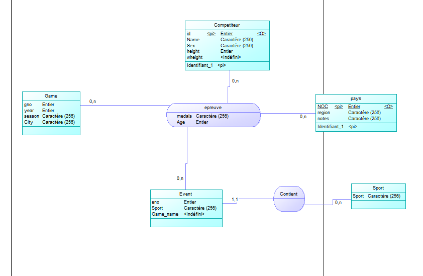

\newpage


**Exercice 1**
======

 
### **Question 1.** 
 - Dans le fichier import il y a 271 117 lignes.

    ```bash
    wc -l [fichier]
    ``` 
    
 - Dans le fichier noc_regions, il y a 230 lignes.

    ```bash
    wc -l [fichier]
    ```
### **Question 2.**
- La première ligne ressemble à cela :
   `ID, Name, Sex, Age, Height, Wheight, Team, NOC, Games, Year, Season, City, Sport, Event, Medal`.

    ```bash
    head -n 1 fichier
    ```

### **Question 3.**

- Le séparateur est la virgule : `,` 


### **Question 4.** 
- Une ligne représente une épreuve d'un athlèthe.

### **Question 5:**
-  Il y a 15 colonnes dans ce fichier.

    ```bash
    head -n 1 [fichier] tr ',' '/n' | wc -l 
    ```

### **Question 6:**
- C'est la colonne `season` qui distingue les jeux d’été et d’hivers.

### **Question 7:**
- 6 lignes fait référence à Jean-Claude Killy.

    ```bash
    grep "Jean-Claude Killy" [fichier] |wc -l
    ```

### **Question 8:**
- Le fichier est encodé en ASCII text

    ```bash
    file -e encoding [fichier]
    ```
### **Question 9:**

- Nous abordons sereinement la ventilation des données, nous avons en tete des entités fortes à placer dans notre modèle conceptuel de données. Néanmoins l'âge des athlètes constitue un problème évidant dans ce problème que nous allons devoir régler.

**Exercice 2**
=====


- *Création de la table import*

 ```SQL
create table import(
    id int,
    name text,
    sex char(1), 
    age int, 
    height int,
    weight float, 
    team text, 
    noc char(3),
    games text,
    year int, 
    season text, 
    city text, 
    sport text,
    event text, 
    medal text
    );
```

- *Création de la table regions*

 ```SQL
create table regions(
    noc char(3) primary key,
    region text, 
    notes text
);
```
- *Importation des données du csv dans la table import*

 ```SQL
\copy import from 'athlete_events.csv' delimiter ',' header null 'NA' quote '"' encoding 'ISO-8859-1' CSV;
```

- *Importation des données du csv dans la table régions*
```SQL
\copy regions from noc_regions.csv delimiter ',' header csv null '';
```

- *Suppressions des données douteuses*

```SQL
delete from import where year  < 1920 or sport = 'Art Competitions';  
```
**Exercice 3**
======

### Question 1

```SQL
SELECT COUNT(*) as exo_Q1 FROM INFORMATION_SCHEMA.COLUMNS WHERE TABLE_NAME = 'import';
```

### Question 2

```SQL
Select count(*) as exo3_Q2 from import ;
```
### Question 3

```SQL
Select count(distinct noc) as exo3_Q3 from regions;
```

### Question 4

```SQL
Select count(distinct id) as exo3_Q4 from import;
```

### Question 5

```SQL
Select count(*) as exo_Q5 from import Where medal ='Gold' ;
```

### Question 6

```SQL
Select distinct count(*) as exo3_Q6 from import where name ='Frederick Carlton "Carl" Lewis';
```


**Exercice 4**
======

### 1. Modèle conceptuel de données.

{#id .class width=600}  

- Pour la ventilation nous avons modélisé le MCD présent sur la page suivante.
- Nous avons mis en place 5 entités et 2 relations qui nous semblaient évidentes pour ce problème, ce sont les suivantes:

    - L'entité ```compétiteur``` qui est constituée d'un id qui vient de la table *import* et qui constitue la clef primaire, vu que dans la table *import* l'ID concerne un athlète. Ensuite le nom le sexe, la taille et le poids. Nous avons bien évidemment bien fait attention au fait les athlètes peuvent changer de poids et taille entre les compétitions mais ce n'est pas le cas, ce qui nous facilite la tâche dans notre cas.

    - L'entité ```games``` qui représente un évènement des Jeux Olympiques, par exemple les Jeux Olympiques d'été à Londres en 2012.
    Dans cette table, nous avons une clef primaire qui est le gno et qui est numérotée automatiquement. Ensuite, nous avons l'année qui est propre à un évènement et ensuite la saison ("été" ou "hiver") et la ville (par exemple "Londres").

    - L'entité ```sport``` où il y a seulement le sport dedans qui est la clef primaire car il y a n'y a pas deux sports qui portent le même nom, à ma connaissance.

    - L'entité ```pays``` qui est constitué du **NOC** (code de pays) qui est la clef primaire vu que le code d'un pays est unique. Ensuite il y a la région et les notes ( ce sont les différentes notes par rapport au pays).

    - L'entité ```event``` qui est étroitement liée à la table sport et qui représente un évènement d'un sport.
    Par exemple les *100 m haies masculins.

    - La relation ```contient``` présente entre l'entité ```event``` et l'entité ```sport```. Qui veut dire qu'un évènement contient un sport. Au niveau des cardinalités, un ```event``` peut *contenir* un et un seul sport (Cardinalité : 1.1). Par exemple le 100 m haies *contient* un seul sport qui est l'athlétisme et non pas plusieurs.
    Ensuite un sport peut *contenir* de zéro à *n* ```event```(Cardinalté: 0.N). Par exemple l'athlétisme peut *contenir* plusieurs ```event```, comme le 110 m haies et le 1 000 m .

    - La relation ```epreuve``` correspond à une épreuve d'un compétiteur à un évent d'un gams . Par exemple Usain Bolt au 100m au Jeux Olympiques de Rio. Cette relationrelie 4 entités *games*,*competiteur*,*event*,*pays* car une épreuve contient un *games*, un *event*,*un pays*, un *compétiteur*. Et elle contient la médaille qu'a obtenue (ou non) le *compétiteur*. Mais elle contient également l'âge. Nous l'avons placé ici et non dans l'entité compétiteur car l'âge du compétiteur varie selon les épreuves. C'est donc pour cela que nous avons choisi cette option.

### 2. Modèle logique. 

Via le modèle conceptuel de données ci-dessus, le modèle logique de données en découlera et sera le suivant.
```
Competiteur(**ID**,name,sex,height,weight) /ID étant la clef primaire
Games(**gno**,year,season,city), /gno étant la clef primaire
Event(**eno**,game_name,#sport), /eno étant la clef primaire et sport une clef étrangère
Sport(**sport**), /sport étant la clef primaire
epreuve(**#eno,#gno,#ID,#NOC**,medal,age). /eno,gno,ID et NOC étant toutes des clefs 
étrangères qui constituent la clef primaire
```


### 3. Insertion des données 

- *Insertion des données de la table pays*

```SQL
Insert into pays Select * From regions ;
```


- *Insertion des données de la table sport*

```SQL
Insert into sport 
Select distinct sport from import order by sport asc;
```


- *Insertion des données de la table games*

```SQL
Insert into games(year,season,city,games) 
select distinct i.year,i.season,i.city,i.games 
from import as i
order by year asc;
```


- *Insertion des données de la table event*

```SQL
Insert into event(game_name,sport) 
select distinct i.event,s.sport 
from import as i, sport as s 
Where s.sport=i.sport;
```


- *Insertion des données de la table compétiteur*

```SQL
Insert into competiteur(name,sex,height,weight,id)
Select distinct i.name,i.sex,i.height,i.weight,i.id  
From import as i order by name asc;
```


- *Insertion des données de la table épreuve*

```SQL
Insert into epreuve(eno,id,gno,age,medal,noc) 
Select e.eno,c.id,g.gno,i.age,i.medal,p.noc
From import as i ,event as e, competiteur as c, games as g pays as p
Where c.id=i.id
And e.game_name =i.event
And p.noc = i.noc
And g.year=i.year 
and g.city=i.city 
and g.season=i.season;

```
### Une question de taille !

- Question 1: 
    Le fichier import.sql fait 3 632 octets.


- Question 2: 

    ```SQL
    SELECT pg_total_relation_size('import');
    ```

    La table import fait 47308800 octets.

- Question 3:

    - *Table sport*
    ```SQL
    SELECT pg_total_relation_size('sport');
    ```
    Cette table fait 32 768 octets.

    - *Table pays*
    ```SQL
    SELECT pg_total_relation_size('pays');
    ```
    Cette table fait 65 536 octets.

    - *Table games*
    ```SQL
    SELECT pg_total_relation_size('games');
    ```
    Cette table fait 32 768 octets

     - *Table event*
    ```SQL
    SELECT pg_total_relation_size('event');
    ```
    Cette table fait 114 688 octets

      - *Table epreuves*
    ```SQL
    SELECT pg_total_relation_size('epreuves');
    ```
    Cette table fait 25976832 octets

       - *Table competiteur*
    ```SQL
    SELECT pg_total_relation_size('competiteur');
    ```
    Cette table fait 12148736 octets


Au global la somme de toutes les tables fait 38 371 328 octets.

- Question 4 :

 Pour cela nous devons exporter toutes les tables avec la commande suivante et faire la somme de tout les fichiers.

 ```SQL
    \copy ma_table to '[ma_table.csv]' delimiters';' csv header NULL as 'null';
 ```

 L'ensemble des fichiers fait donc 1,1e+7 octets.


**Exercice 5**
======

- Question 1

```SQL
Select region,count(*) 
from epreuve as e, pays as p 
where p.noc=e.noc 
group by region 
order by count desc;
```

- Question 2


```SQL
Select region,count(*)
from epreuve as e, pays as p
where e.noc = p.noc
and medal='Gold' 
group by region
order by count desc;
```

- Question 3

```SQL
Select region,count(*) 
from epreuve as e, pays as p
where e.noc=p.noc
and medal is not null 
group by region
order by count desc;
```

- Question 4

```SQL
Select name,count(*) 
from epreuve as e, competiteur as c 
where c.id=e.id 
and medal='Gold' 
group by c.name 
order by count desc;
```

- Question 5

```SQL
Select noc,count(*) from epreuve as e, games as g 
where e.gno=g.gno 
and city='Albertville' 
and medal in('Bronze','Silver','Gold') 
group by noc 
order by count desc;
```

- Question 8

```SQL
Select age,count(*) 
from epreuve 
where medal ='Gold' 
and age is not null 
group by age 
order by age desc;
```

- Question 9

```SQL
Select sport,count(*) 
from epreuve as e,event as ev 
where e.eno=ev.eno 
and medal is not null 
and age is not null 
and age >50 group by sport 
order by sport;

```

- Question 10

```SQL
Select count(*),season,year 
from epreuve as e , games as g,event as ev 
Where e.gno=g.gno 
and ev.eno=e.eno 
group by season,year 
order by year;
```

- Question 11

```SQL
Select count(*),year from epreuve as e, games as g,competiteur as c 
where g.gno=e.gno 
and c.id=e.id 
and medal is not null 
and sex='F' 
and season='Summer' 
group by year 
order by year; 
```

*REMARQUE: A noter au niveau de ces requêtes que vous pouvez constater que les résultats que nous avons trouvé sont différents des résultats que l'on peut trouver sur internet. En effet quand on compte les médailles nous voyons une différence. Cela est dû au fait que cette base de données prend en compte les médailles de manière individuelle. En effet, par exemple, sur la documentation en ligne une épreuve où il y a quatre participants, par exemple le relai 4 fois 100 m, s'il y a médaille, pour la documentation cela représente **seulement une médaille** et **non quatre**. Alors que sur cette base de données donc pour nos requêtes cela représente **quatre médailles** et **non une**.*

**Exercice 6**
======

### Personnalisation du rapport

Pour cet exercice nous avons choisi le ```JUDO français``` lors des jeux olympiques .
Pour analyser cette discipline nous avons effectué quatre requêtes sur notre base de données.


Nous avons commencé par vouloir savoir comment le judo français (féminin et masculin) se classe au niveau des médailles par rapport aux autres pays.
Cette requête permet de répondre à cette question.

```SQL
Select noc,count(*)
from epreuve as e1, event as e2,competiteur as c,games as g 
where e1.eno=e2.eno 
and g.gno=e1.gno 
and c.id=e1.id 
and medal is not null
and sport='Judo'
group by noc
order by count desc;
```

Nous pouvons alors constater que la France se classe deuxième de ce classement derrière le pays du JUDO qui est le Japon.

<br>
<br>

Nous allons ensuite grace à deux requêtes savoir combien de médailles ont respectivement le JUDO féminin et le JUDO masculin toujours par rapport aux autres pays.

<br>
*/Requete permettant de savoir le classement de la france au judo masculin du niveau des médailles par rapport aux autres pays.*

<br>

```SQL
Select noc,count(*)
from epreuve as e1, event as e2,competiteur as c,games as g 
where e1.eno=e2.eno 
and g.gno=e1.gno 
and c.id=e1.id 
and medal is not null
and sport='Judo' 
and c.sex='M'
group by noc
order by count desc;

```

Nous pouvons grace à cette requête que le judo français se place 3ème de ce classement avec aux globales 30 médailles. Juste devant se trouve deux grands pays institutionnels du JUDO masculin qui est la Corée du Sud et le Japon.
Nous allons maintenant s'interreser au JUDO féminin.

<br>
*/Requete permettant de savoir le classement de la france au judo féminin du niveau des médailles par rapport aux autres pays.*

```SQL
Select noc,count(*)
from epreuve as e1, event as e2,competiteur as c,games as g 
where e1.eno=e2.eno 
and g.gno=e1.gno 
and c.id=e1.id 
and medal is not null
and sport='Judo' and c.sex='F'
group by noc
order by count desc;
```
<br>
Grâce à cette requête nous pouvons constater que le JUDO féminin se classe 4ème de ce classement avec 19 médailles, derrière (toujours) le Japon, et cette fois-ci la Chine et CUBA  .

<br>
<br>

Nous avons à ce stade vu les différents classements des Français au JUDO . Mais nous allons maintenant faire un *focus* sur un athlète français qui constitue un pillier dans le JUDO français. Nous allons bien évidemment nous intéresser à **Teddy Riner**. Nous allons grace à une requête affichée les médailles qu'il a obtenues aux Jeux Olympiques et nous allons les analyser.

*/Rêquete permettant d'afficher le détail des médailles aux JO de Teddy Riner

```SQL
Select name,sport,age,game_name,games,medal
from epreuve as e1, event as e2,competiteur as c,games as g 
where e1.eno=e2.eno 
and g.gno=e1.gno 
and c.id=e1.id 
and medal is not null
and sport='Judo' and noc='FRA' 
and name like 'Teddy%';
```

Nous pouvons donc grace à cette requête que Teddy Rinner a remporté trois médailles lors des jeux olympiques. Nous allons donc s'interresser à chacune en notifiant les caractéristiques de chacune.

- Médaille de bronze - Jeux olympiques de Beijing 2008 :
    Teddy Riner a remporté sa première médaille olympique en 2008, lorsqu'il a remporté la médaille de bronze en judo dans la catégorie des plus de 100 kg. À l'époque, il n'avait que 19 ans et était le plus jeune judoka à remporter une médaille olympique dans cette catégorie.

- Médaille d'or - Jeux olympiques de Londres 2012 :
    Lors des Jeux olympiques de 2012 à Londres, Teddy Riner a remporté la médaille d'or en judo dans la catégorie des plus de 100 kg. Il a remporté tous ses combats sans aucune pénalité et a réussi à projeter son adversaire en finale pour obtenir la médaille d'or.

- Médaille d'or - Jeux olympiques de Rio 2016 :
    Teddy Riner a de nouveau remporté la médaille d'or en judo dans la catégorie des plus de 100 kg lors des Jeux olympiques de Rio en 2016. Il a remporté tous ses combats sans aucune pénalité et a réussi à projeter son adversaire en finale pour obtenir la médaille d'or. Cette victoire a fait de lui le premier judoka à remporter deux médailles d'or olympiques consécutives dans cette catégorie.

En résumé, Teddy Riner a remporté trois médailles olympiques, dont une médaille de bronze à Beijing en 2008 et deux médailles d'or à Londres en 2012 et à Rio en 2016. Il est entre autre connu pour sa force physique, sa technique et son habileté à projeter ses adversaires pour marquer des points et cela a permis qu'il devienne un membre à part entière du sport français.


